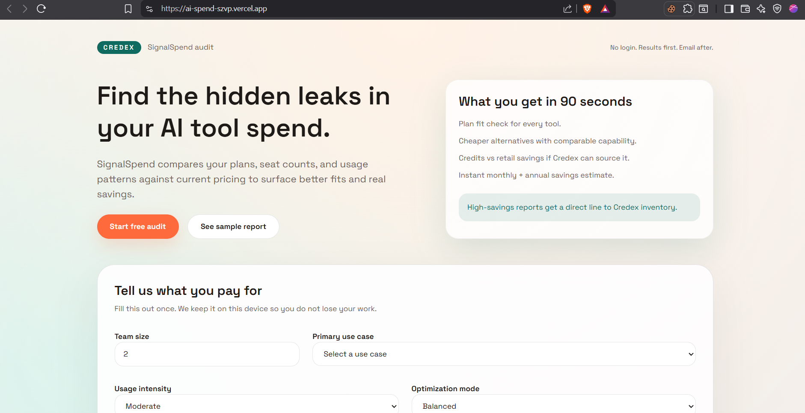
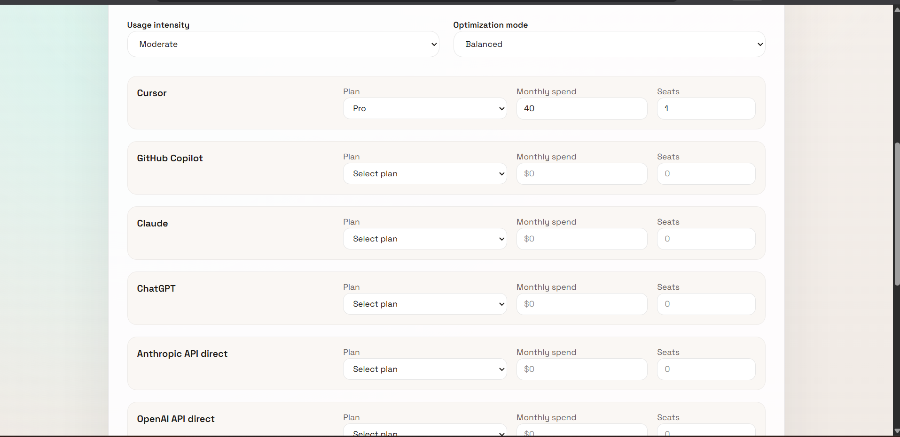
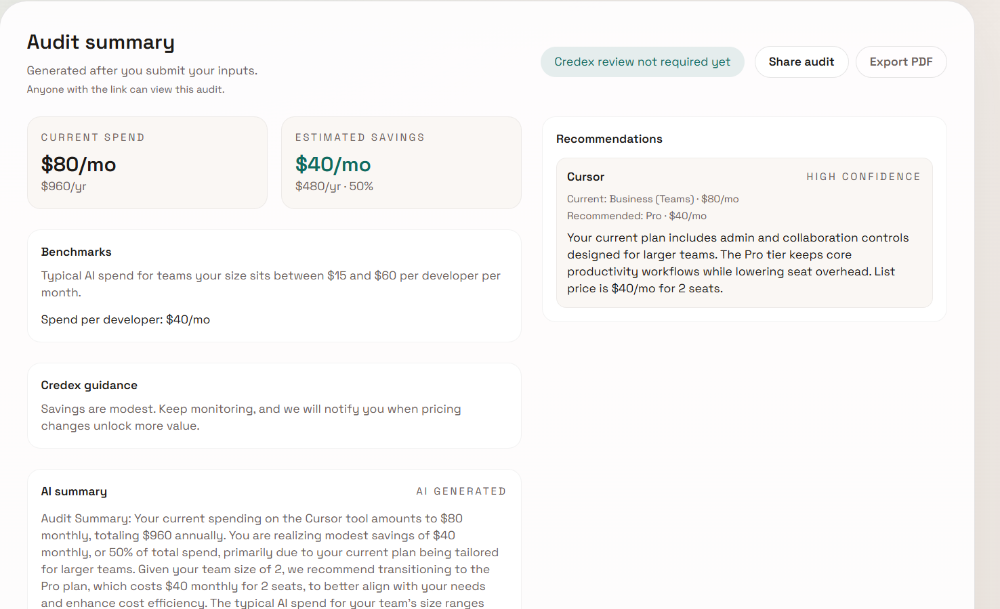
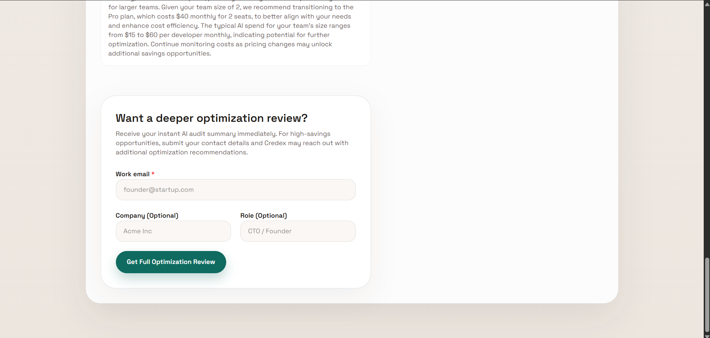
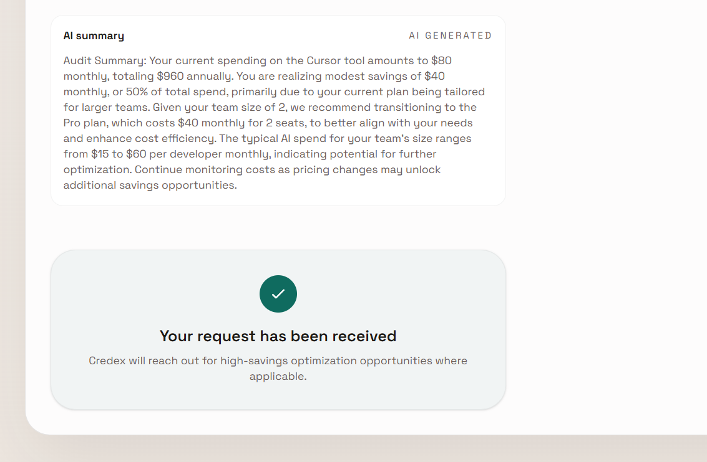
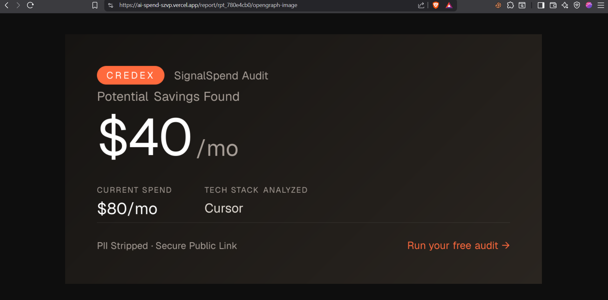

# SignalSpend AI Audit Tool

SignalSpend is a free, instant audit tool designed for startup founders and engineering managers to analyze their AI tool stack and discover immediate cost-saving opportunities. By evaluating current tool spend against industry benchmarks and identifying overlapping subscriptions, it provides actionable downgrade or consolidation recommendations while serving as a high-quality lead-generation asset for Credex.

## Preview

*(Please replace these placeholders with your actual screenshots or a Loom recording link)*









**Live Demo:** [https://ai-spend.vercel.app/](https://ai-spend-szvp.vercel.app/)

---

## Quick Start

### Prerequisites
- Node.js 18+
- A Supabase account (for database)
- Resend API Key (for emails)
- OpenRouter API Key (for AI summaries)

### Install & Run Locally

1. **Clone the repository:**
   ```bash
   git clone https://github.com/Manukesharwani09/ai-spend.git
   cd ai-spend
   ```

2. **Install dependencies:**
   ```bash
   npm install
   ```

3. **Configure Environment Variables:**
   Create a `.env` file in the root directory:
   ```env
   NEXT_PUBLIC_SUPABASE_URL=your_supabase_url
   SUPABASE_SERVICE_ROLE_KEY=your_supabase_service_role_key
   OPENROUTER_API_KEY=your_openrouter_api_key
   RESEND_API_KEY=your_resend_api_key
   NEXT_PUBLIC_SITE_URL=http://localhost:3000
   ```

4. **Run the development server:**
   ```bash
   npm run dev
   ```
   Open [http://localhost:3000](http://localhost:3000) to view the application.

### Deploy
Deploying to Vercel is highly recommended:
1. Push your code to GitHub.
2. Import the repository into Vercel.
3. Add the environment variables in the Vercel dashboard.
4. Click Deploy.
---

## Decisions & Trade-offs

Here are 5 key architectural and product decisions made during development:

1. **Local-First Audit Engine (No DB writes for generation)**
   - *Decision:* The core pricing math and recommendation logic (`lib/audit.ts`) runs entirely in the client's browser.
   - *Why:* Ensures zero latency, instant updates, and eliminates database costs for casual tire-kickers. The database is only touched when a user explicitly shares an audit or submits a lead form.
2. **Immutable Snapshots for Sharing over Base64 URLs**
   - *Decision:* Replaced massive Base64 URL payloads with short, immutable IDs (`rpt_1a2b3c`) backed by Supabase JSONB storage.
   - *Why:* Massive URLs were fragile, looked spammy on social media, and broke if the schema evolved. Snapshots ensure that what the user shared is exactly what the viewer sees, preserving the viral OpenGraph preview.
3. **Hardcoded Math vs. AI-Driven Math**
   - *Decision:* The audit logic uses deterministic, hardcoded rules (`PRICING_DATA.md`) rather than asking an LLM to calculate savings.
   - *Why:* LLMs are notoriously bad at math and hallucinate pricing tiers. Hardcoded rules guarantee that a finance professional will agree with the numbers. AI is reserved strictly for generating the personalized text summary.
4. **Decoupled AI Summary Generation**
   - *Decision:* The AI summary runs via an asynchronous Next.js API route (`/api/summary`) while the UI renders the hard math instantly.
   - *Why:* LLM generation takes 2-4 seconds. Decoupling it prevents the UI from blocking. We gracefully fall back to a templated summary if the OpenRouter API fails, ensuring the user experience never breaks.
5. **Form State in LocalStorage**
   - *Decision:* User inputs are saved in the browser's `localStorage` rather than a server session.
   - *Why:* Allows users to accidentally refresh the page, close their laptop, or navigate away without losing the 10 inputs they just filled out. It provides a premium UX without requiring them to create an account.
